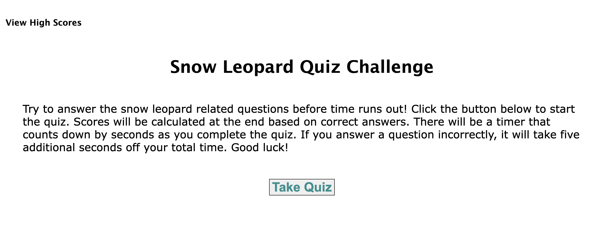

# timed-quiz

## project description
This project involves creating a multiple question quiz for a user with a timer element. The user will select the "start button" to begin the quiz. During the quiz, the user will answer a series of question in which he/she will have to select the answer. Each answer will be documented whether it is correct or incorrect and tallied to the final score. The user will be notified by the browser whether their score is correct or incorrect. If incorrect, the user's timer will be decrease as a penalty for an incorrect score. At the end of the game, the user will be notified of their overall score. From there, the user will be able to input their intials and be logged into a high score board. 

The technical pieces of the project involve using local storage, arrays, CSS styling and event listeners. This project could be improved by being able to select multiple answers to the quiz questions that are correct (i.e. select all the following). 

This project solves creating a timed quiz for a user.

## usage

Timed Quiz Screenshot:

Link to Webpage:https://lavollmer.github.io/timed-quiz/

## credits

Collaborators include the U of MN Bootcamp tutoring services, AskBCS, and lecture. 

Received this logic from a tutor after discussion:

  button.addEventListener("click", function (event) {
    event.preventDefault();
    localStorage.setItem(input.value, winCounter);
    scoreBoard();
  })

Received this logic from a tutor after discussion:

  for (let i = 0; i < localStorage.length; i++) {
    const key = localStorage.key(i);
    var displayScore = `${key}: ${localStorage.getItem(key)}`;
    var pTag = document.createElement("p");
    pTag.textContent = displayScore;
    scoreboard.appendChild(pTag);
  }

AskBCS provided in checkAnswer function (see commented sections):

  } else {
    (buttonAnswer !== questions[questionsCounter].answer); {
      correct.textContent = "Incorrect!"
//received -=5 for timer from AskBCS
      secondsLeft -= 5;
//AskBCS said to delete this
      // setTime();
    }
  }

AskBCS provided in checkAnswer function (see commented sections):

function setTime() {
  timerInterval = setInterval(function () {
    secondsLeft--;
    timeEl.textContent = secondsLeft;
//received <=0> from AskBCS
    if (secondsLeft <= 0) {
      endQuiz();
    }
  }, 1000)
}

Received scrollIntoView method:
https://developer.mozilla.org/en-US/docs/Web/API/Element/scrollIntoView

## license
MIT License